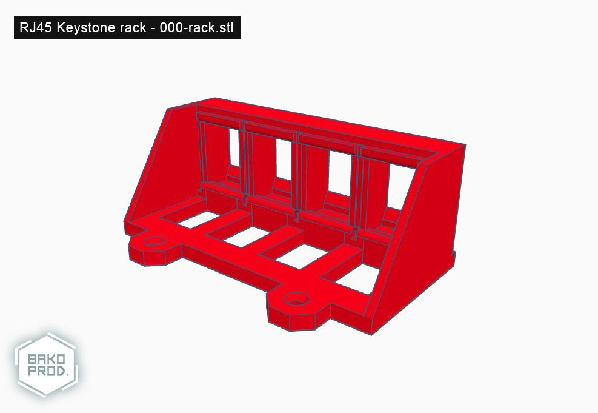

# 000-rack (RJ45 Keystone rack - Rack)

## Informations

**Version**: `1.0`

**Reference**: `000-rack`

**Name**: `Rack`

## Printing details

|Infill   |Supports         |Rafts            |Resolution   |Filament   |
|-        |-                |-                |-            |-          |
|17%      |Doesn't matter   |Doesn't matter   |0.20mm       |PLA        |

## Images

