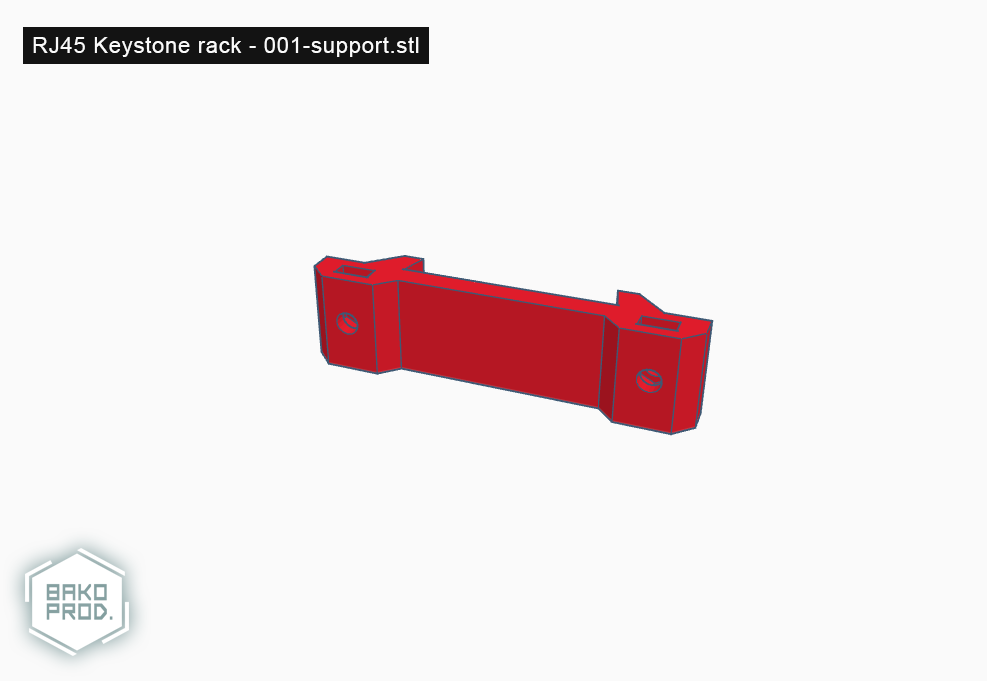

# 001-support (RJ45 Keystone rack - Optional support)

## Informations

**Version**: `1.0`

**Reference**: `001-support`

**Name**: `Optional support`

> **Note**: this part is compatible with M3 screws and nuts

## Printing details

|Infill   |Supports         |Rafts            |Resolution   |Filament   |
|-        |-                |-                |-            |-          |
|17%      |Doesn't matter   |Doesn't matter   |0.20mm       |PLA        |

## Images

